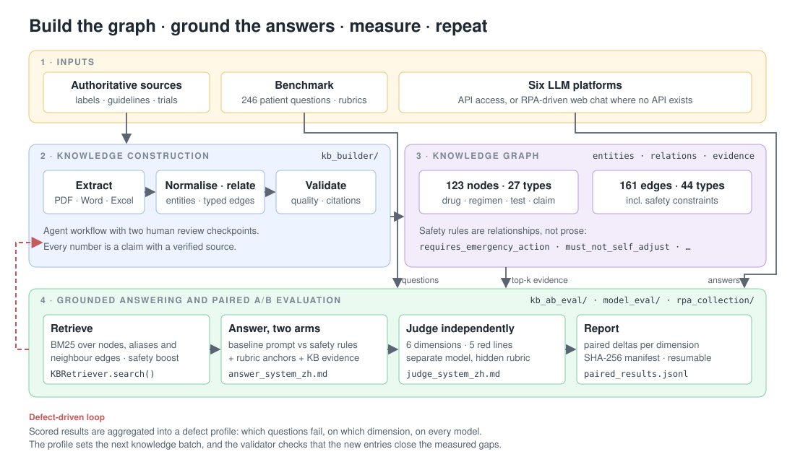

# Medical Knowledge-Graph Agent

Code from a data-science internship project (2026) that makes consumer AI
platforms answer patient questions about cancer bone metastasis more accurately,
safely and consistently. The approach: turn authoritative medical sources into
an evidence-linked knowledge graph, ground model answers in that graph, and
measure the effect with a rubric-based, LLM-judged A/B evaluation across six
Chinese LLM platforms. Measured defects then drive the next round of knowledge
construction.

The repository contains the code, prompts, schemas and tests. It does not
contain the knowledge-graph content, the question benchmark, model responses,
evaluation exports, or any patient data. See [What is not here](#what-is-not-here).



## Components

| Module | What it does |
| --- | --- |
| [`kb_builder/`](kb_builder/) | Agent skill and scripts that turn PDFs, Word, Excel, scanned documents and CNKI or ClinicalTrials exports into a structured, source-traceable knowledge base. Entities, typed relationships, normalisation tables and claim-level evidence live in one JSON; Markdown or Word deliverables are generated from it. Includes multi-channel citation verification, a quality validator and a defect-driven optimisation loop. 61 tests. |
| [`kb_ab_eval/`](kb_ab_eval/) | Paired A/B harness: for each of six platforms, answer every benchmark question once with a plain prompt and once with safety rules, per-question rubric anchors and top-k evidence retrieved from the knowledge graph. An independent judge scores both arms on six dimensions plus red lines. Runs are content-addressed and resumable. |
| [`model_eval/`](model_eval/) | Multi-provider runner over OpenAI-compatible APIs with per-provider timeouts, retries and connection pooling; optional search augmentation (Tavily and Doubao); parallel and resumable execution; a JSON-schema LLM-as-judge scorer; HTML and Markdown report generation. |
| [`rpa_collection/`](rpa_collection/) | Collecting answers from platforms that only expose a web chat UI: Playwright scripts that run inside an RPA worker (stdin/stdout contract, storage-state login), a local Chrome fallback, and orchestrators that keep all models in the same time window so live web search does not drift. |
| [`ckpa_bench/`](ckpa_bench/) | Earlier benchmark pipeline (CKPA-Bench): builds items where two authoritative sources conflict (jurisdiction, guideline version, drug label versus decision support, drug-drug interaction) and measures whether a model arbitrates correctly with and without the sources. |
| [`data_pipeline/`](data_pipeline/) | Two-stage extraction of real patient questions from consultation transcripts: regex normalisation, then batched LLM extraction with character-budgeted batches and JSONL checkpoints for resumable runs. |

## Knowledge graph design

The graph is stored as `entities.jsonl` and `relations.jsonl` with one Markdown
document per entity (JSON front matter plus body). The delivered version had
123 verified nodes across 27 entity types and 161 typed edges across 44
relation types, every one of them carrying evidence.

- **Node types** include `Drug`, `Product`, `Regimen`, `Disease`, `DiseaseStage`,
  `Test`, `AdverseEvent`, `Symptom`, `Emergency`, `Population`, `ClinicalClaim`,
  `ClinicalBoundary`, `AnswerSafetyBoundary` and `EvidenceDocument`. Claims and
  boundaries are nodes, not prose, so a single card can be retrieved on its own.
- **Edges** are standard verbs: `is_a`, `regimen_for`, `approved_for`,
  `causes_adverse_event`, `requires_baseline_test`, `requires_followup_test`,
  `binds_to`, `inhibits`, `supported_by`. Vague "related to" edges are rejected
  by the validator.
- **Safety constraints are edges** the answer generator must obey:
  `requires_emergency_action`, `must_not_self_adjust`,
  `requires_clinician_decision`, `does_not_replace`,
  `not_interchangeable_with`, `not_combined_with`, `requires_context_lock`.
  `requires_context_lock` forces the agent to confirm the disease scenario
  before it names a product, dose or schedule when a patient uses a colloquial
  term that covers several drugs.
- **Evidence** on every node and edge records the source asset id, source grade
  (`[S]` label, `[G]` guideline, `[T]` trial, `[I]` internal), a locator, the
  minimal quote and the SHA-256 of the excerpt. Nothing is published as
  `verified` with empty evidence.
- **Normalisation** keeps synonym (=), hierarchy (is-a) and association
  (related) distinct, and records explicit do-not-merge pairs for entities that
  models routinely confuse.

## Evaluation design

- **Benchmark.** 246 patient questions, each with a hidden per-question rubric
  built from professional evidence first and validated against real patient
  phrasing second (`model_eval/prompts/`).
- **Six dimensions**, scored 0 / 0.5 / 1 by the judge: information coverage,
  accuracy, completeness, safety, traceability, consistency. **Five red lines**
  (for example advising self-adjustment of therapy, or downgrading an emergency
  to "see a doctor when convenient") veto a pass regardless of score.
- **Separation of roles.** The optimised arm sees the rubric to write a better
  answer, but never scores itself. The judge is a different model with the
  original question, the hidden rubric, the answer and the KB evidence used.
- **Reproducibility.** Each run writes a manifest with SHA-256 digests of the KB
  tree, benchmark workbook, both system prompts and the platform config, and
  appends answers and scores as JSONL so interrupted runs resume.
- **Defect profiling.** `kb_builder/scripts/analyze_eval.py` aggregates a scored
  export into per-question, per-dimension failure hotspots, flagging questions
  every model fails. Those hotspots set the priority of the next KB batch, and
  `validate_kb.py --defects` checks the new content covers them.

## Getting started

```bash
# KB builder (pure Python; python-docx and pdfplumber for Word/PDF)
pip install python-docx pdfplumber
python3 kb_builder/scripts/validate_kb.py kb_builder/examples/example-kb.json
python3 kb_builder/scripts/build_kb_md.py kb_builder/examples/example-kb.json out.md
python3 -m pytest kb_builder/tests            # 61 tests, no external data needed

# A/B evaluation (needs a KB directory, the benchmark workbook and API keys)
pip install -r kb_ab_eval/requirements.txt
python3 -m kb_ab_eval.run validate --kb <kb-dir> --benchmark <benchmark.xlsx>
python3 -m kb_ab_eval.run answers --run-id demo --kb <kb-dir> --benchmark <benchmark.xlsx>
python3 -m kb_ab_eval.run judge   --run-id demo --kb <kb-dir> --benchmark <benchmark.xlsx>
python3 -m kb_ab_eval.run report  --run-id demo

# Multi-model runner
cp model_eval/.env.example model_eval/.env   # fill in provider keys
pip install -r model_eval/requirements.txt
python3 model_eval/run_parallel.py --limit 3
```

Platform endpoints and model names are configured in
`kb_ab_eval/config/platforms.example.json` and `model_eval/models.py`. API keys
are read from environment variables only.

## What is not here

- The knowledge-graph content, source documents, question benchmark, model
  responses and scored exports. They are the client's medical and proprietary
  material and are excluded by `.gitignore` (all JSONL, CSV, XLSX, SQLite, HTML
  and PDF files).
- Patient consultation data used for question mining.
- Internal platform code (the RPA platform and the Java evaluation backend the
  collection scripts call). Their public interfaces are described in
  `rpa_collection/SETUP_GUIDE.md`.

Four tests in `kb_ab_eval/tests` load the KB and benchmark and therefore need
those files locally; the remaining tests run standalone.

**Stack:** Python 3.12, OpenAI-compatible SDK clients, httpx, Playwright,
openpyxl, python-docx, pdfplumber, Tesseract / macOS Vision OCR; Claude Code
skill format for the agent workflow.
